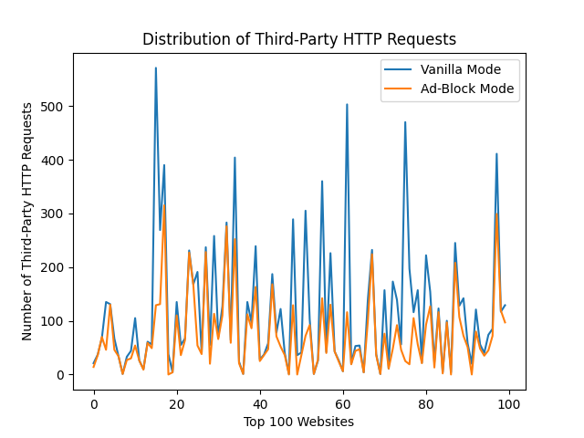
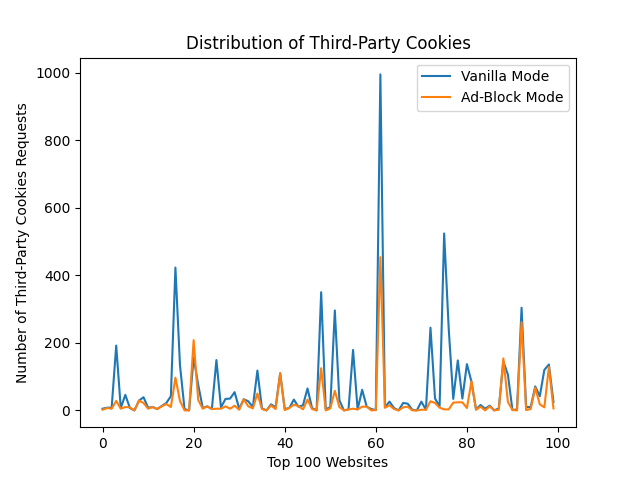
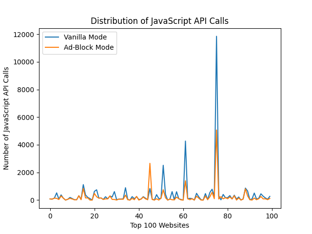

# Introduction to OpenWPM Crawling

This mini project is a introduction to a open-source web-crawling tool called OpenWPM. Below is the analysis of data in two modes (vanilla mode and ad-blocking mode). 

## HTTP(S) Requests 
### Differences between two distributions

The plot above shows a great difference bwteeen the number of third-party HTTP requests in vanilla mode and ad-blocking mode. Specifically, for each website, the number of third-party HTTP requests made without ad-blocker is at least greater than that with ad-blocker.

#### Top 10 third-party domains with HTTP(S) requests

|     | Domain (v)            | # of HTTP Requests (v) | | Domain  (a)           | # of HTTP Requests (a) |
| --: | :-------------------- | -----------------: | --- | :-------------------- | ----------------: |
|   1 | ssl-images-amazon.com |                531 |     | ssl-images-amazon.com |               533 |
|   2 | sohu.com              |                333 |     | msocdn.com            |               255 |
|   3 | doubleclick.net       |                301 |     | csdnimg.cn            |               217 |
|   4 | alicdn.com            |                265 |     | cloudfront.net        |               203 |
|   5 | msocdn.com            |                255 |     | pstatic.net           |               198 |
|   6 | google.com            |                245 |     | alicdn.com            |               197 |
|   7 | csdnimg.cn            |                214 |     | pinimg.com            |               195 |
|   8 | pstatic.net           |                210 |     | sinaimg.cn            |               155 |
|   9 | cloudfront.net        |                208 |     | qhimg.com             |               154 |
|  10 | pinimg.com            |                200 |     | awsstatic.com         |               149 |

('v' stands for vanilla mode, 'a' stands for ad-blocking mode)

`ssl-images-amazon.com` is the most popular third-party domain for both modes. `qhimg.com` and `pinimg.com` are also image servers. 

`doubleclick.net` is the ad-serving website.

`cloudfront.net` is part of a content delivery network with ads.

The rest of domains are either CDNs or services provider by some companies and they are not very malicious I think.

By applying ad-blocker, the ad-serving website `doubleclick.net` disappeared from the list. 

## Cookies

The plot above shows a great difference bwteeen the number of third-party cookies stored in vanilla mode and ad-blocking mode. Most of the time, the number of third-party cookies stored without ad-blocker is greater or equal to that with ad-blocker. Only a few websites have more third-party cookies stored by using the ad-blocker.

#### Top 10 third-party domains storing cookies

|     | Domain (v)            | # of Cookies Storing (v) | | Domain  (a)         | # of Cookies Storing (a) |
| --: | :-------------------- | -----------------: | --- | :-------------------- | ----------------: |
|   1 | yahoo.com             |                618 |     | cnn.com               |               451 |
|   2 | cnn.com               |                513 |     | cloudflare.com        |               261 |
|   3 | cloudflare.com        |                277 |     | taobao.com            |               201 |
|   4 | demdex.net            |                251 |     | amazon.com            |               137 |
|   5 | pubmatic.com          |                220 |     | creativecommons.org   |               129 |
|   6 | doubleclick.net       |                145 |     | aliexpress.com        |               112 |
|   7 | amazon.com            |                139 |     | yahoo.com             |               106 |
|   8 | rubiconproject.com    |                138 |     | ebay.com              |               69  |
|   9 | casalemedia.com       |                137 |     | weebly.com            |               67  |
|  10 | creativecommons.org   |                136 |     | msn.com               |               62  |

('v' stands for vanilla mode, 'a' stands for ad-blocking mode)

`demdex.net`, `pubmatic.com`, `doubleclick.net`, `rubiconproject.com`, and `casalemedia.com` are all related to ad-serving / data collection. 

The rest of domains are either CDNs or services provider by some companies and they are not very malicious I think.

By applying ad-blocker, the ad-serving websites disappeared from the list, and only nonmalicious domains are still on the list. 

## JavaScript

#### Top 10 third-party domains that are making JavaScript API calls

|     | Domain (v)            | # of JS API Calls (v) | | Domain  (a)           | # of of JS API Calls (a) |
| --: | :-------------------- | -----------------: | --- | :-------------------- | ----------------: |
|   1 | forbesimg.com         |               7048 |     | forbesimg.com         |              5066 |
|   2 | media.net             |               2355 |     | wsimg.com             |              2560 |
|   3 | google-analytics.com  |               2308 |     | alicdn.com            |              1088 |
|   4 | segment.com           |               2112 |     | itc.cn                |               781 |
|   5 | alicdn.com            |               1284 |     | segment.com           |               650 |
|   6 | moatads.com           |               1112 |     | cnn.com               |               601 |
|   7 | doubleclick.net       |                916 |     | nytimes.com           |               595 |
|   8 | adobedtm.com          |                888 |     | youtube.com           |               561 |
|   9 | itc.cn                |                848 |     | guim.co.uk            |               398 |
|  10 | googletagmanager.com  |                794 |     | bbci.co.uk            |               370 |

('v' stands for vanilla mode, 'a' stands for ad-blocking mode)

`media.net`, `segment.com`, `moatads.com`, and `doubleclick.net` are all related to ad-serving / data collection. 

The rest of domains are either CDNs or services provider by some companies and they are not very malicious I think.

By applying ad-blocker, the ad-serving websites disappeared from the list, and only nonmalicious domains are still on the list. 
